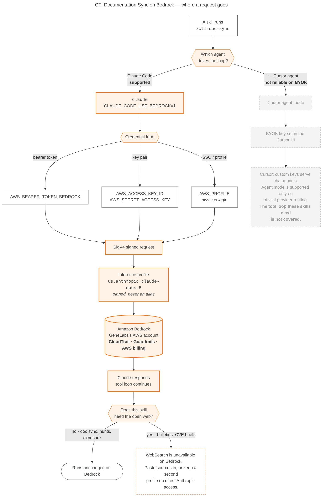
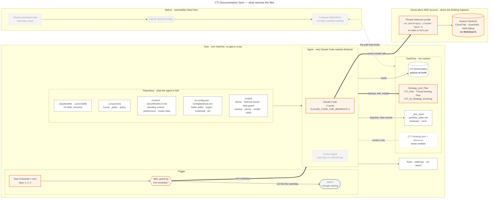

# Architecture

Three diagrams. Each answers one question: what reaches the files, where a model call goes, and what
happens on a run. All are Mermaid, so they render in Cursor, Claude Code, GitHub
and any Markdown preview, and each has a PNG and an SVG next to its source in
`docs/diagrams/` for dropping into a deck.

Every diagram carries its title in the source, so the title travels with it
whether you read it here, open the PNG, or paste the block somewhere else.

The `.mmd` files are the originals. After editing one:

```
./scripts/render_diagrams.sh      # or .\scripts\render_diagrams.ps1
```

That needs the Mermaid CLI, `npm install -g @mermaid-js/mermaid-cli`. Nothing
else in the repository depends on it.

---

## Where a request goes

This build sends model calls to GeneLabs's own AWS account. The diagram shows
why the engine choice is not a preference here: only Claude Code carries the
Bedrock configuration into the tool loop. Cursor's agent branch is drawn greyed
out because a BYOK key there serves chat, not the agent loop these skills need.

The bottom fork is the one to remember day to day. WebSearch does not exist on
Bedrock, so a skill's dependence on the open web decides whether it runs
unchanged.



[PNG](diagrams/cti-documentation-sync-bedrock-routing.png) · [SVG](diagrams/cti-documentation-sync-bedrock-routing.svg) · [source](diagrams/cti-documentation-sync-bedrock-routing.mmd) · [the full picture](BEDROCK.md)

---

## Infrastructure

The point of this one is the reachability boundary. The old arrangement had a
gap in it: a scheduled task in Anthropic's cloud could only touch the OneDrive
folders through the Claude desktop bridge, and on 2026-09-01 that bridge was not
there, so a run fired correctly and reached nothing. Everything now sits on one
machine, and there is no gap left to fail.

Note what the agent may and may not touch. `CTI Deliverables` is read only in
practice because it is the source of truth. `Strategy_and_Plan` is the only
place anything is written, always after a backup. The two strategy decks are
never written at all.

The subgraphs are not numbered. Mermaid lays them out by edge structure rather
than by any order imposed on it, and a number that disagrees with the reading
order is worse than no number. The arrows carry the sequence.



[PNG](diagrams/cti-documentation-sync-infrastructure.png) · [SVG](diagrams/cti-documentation-sync-infrastructure.svg) · [source](diagrams/cti-documentation-sync-infrastructure.mmd)

The engine box holds two entries but only one is live. Claude Code carries the
Bedrock configuration, so every model call leaves the machine for the pinned
inference profile in GeneLabs's AWS account, where CloudTrail, guardrails and
billing already apply. Cursor's agent is drawn greyed out: it reads the same
skills, but a BYOK key there serves chat rather than the agent loop, so it never
reaches that box.

The repository box is what the agent is told before it starts: the mirrored
skills, the always-on rules, April's standing context, the model roles in
`MODELS.md`, the two folder paths, and the Bedrock region, credential and pin.

---

## The monthly run

This one is mostly gates, which is the honest shape of the task. Four of the
decision points can end the run without a single edit, and that is a success
rather than a failure:

| Gate | Ends the run when |
| --- | --- |
| Step 0, date guard | Today is not the first weekday. Two of the three firings each month stop here. |
| Step 2, material or routine | Nothing happened that documentation should record. |
| Step 3, lock and mtime | She has the document open, or edited it since the backup. The run reloads her version rather than forcing past it. |
| Step 6, quality gate | Something failed verification. Revert from the backup and flag it. |

The measure of a good run is not how much changed. A run that correctly
concludes nothing material happened and changes nothing has done its job.

```mermaid
---
title: CTI Documentation Sync — the monthly run
---
flowchart TB

    START(["Scheduler fires<br/>1st, 2nd or 3rd"]) --> G0{{"Step 0<br/>first weekday<br/>of the month?"}}
    G0 -- no --> QUIT(["Change nothing<br/><i>Not the first weekday of the month.<br/>No action taken.</i>"])
    G0 -- yes --> S1["Step 1 · Read the state record<br/><code>_doc_sync/portfolio_state.md</code><br/><b>this is the baseline, not file timestamps</b>"]

    S1 --> S2["Step 2 · Survey the deliverables<br/>counts by class · the two running logs · newest per class"]
    S2 --> MAT{{"Material change,<br/>or routine volume?"}}

    MAT -- "routine<br/><i>another weekly report · another bulletin<br/>in an established category</i>" --> NOOP(["No edits at all<br/><i>No material changes detected.<br/>Documentation and strategy<br/>remain current.</i>"])

    MAT -- "material<br/><i>new artifact type · changed cadence · new platform<br/>new pipeline · changed taxonomy · false statement</i>" --> S3

    subgraph PERDOC["Step 3 · Per document, in this order"]
        direction LR
        S3["Back up first<br/><code>backup_doc.py --reason</code>"]
        LOCK{{"Open in Word,<br/>or mtime moved?"}}
        S3 --> LOCK
        LOCK -- yes --> RELOAD["Reload her version,<br/>reapply on top<br/><b>never force</b>"] --> EDIT
        LOCK -- no --> EDIT["Edit content<br/>clone a styled paragraph,<br/>never build one from a style name"]
        EDIT --> BRAND["Step 3b · Restyle<br/><code>restyle_cti_doc.py</code><br/>banner · FF7109 · Arial · footer<br/><b>no TLP on internal documentation</b>"]
        BRAND --> PDF["Render to PDF and look at it"]
        PDF --> LOOK{{"Branding correct?"}}
        LOOK -- no --> EDIT
        LOOK -- yes --> S4["Step 4 · Append one revision row<br/>the document's own version and date format,<br/>naming sections and source"]
    end

    S4 --> S5{{"Step 5 · Does the evidence<br/>change the AI strategy?"}}
    S5 -- no --> S6
    S5 -- yes --> DECK["Update <code>CTI_AI_Strategy_Evolving.pptx</code><br/>existing layouts only<br/>OBSERVED · IMPLICATION · RECOMMENDATION<br/><b>each change names its evidence</b>"] --> S6

    S6["Step 6 · Quality and traceability<br/>claims supported · no contradictions · branding · unchanged material untouched<br/>terminology consistent · revision histories accurate · deck traceable"]
    S6 --> Q{{"All seven pass?"}}
    Q -- no --> FIX["Fix, or revert from the backup<br/>and flag for human review"] --> S6
    Q -- yes --> S7["Step 7 · Rewrite the state record<br/>inventory · drift · versions · run history"]
    S7 --> S8["Step 8 · Run report to <code>_doc_sync/runs/</code><br/>then <code>notify.py</code><br/>toast · webhook"]
    S8 --> DONE(["Done"])

    NOOP --> DONE
    QUIT --> ENDQ(["Done"])

    classDef gate fill:#FFF3E8,stroke:#FF7109,stroke-width:2px,color:#444648
    classDef step fill:#FFFFFF,stroke:#676765,color:#444648
    classDef quiet fill:#F4F4F4,stroke:#676765,color:#676765
    classDef warn fill:#FFFFFF,stroke:#FF7109,color:#444648,stroke-dasharray:4 3

    class G0,MAT,LOCK,LOOK,S5,Q gate
    class S1,S2,S3,EDIT,BRAND,PDF,S4,DECK,S6,S7,S8 step
    class QUIT,NOOP,START,DONE,ENDQ quiet
    class RELOAD,FIX warn
```



[PNG](diagrams/cti-documentation-sync-run-flow.png) · [SVG](diagrams/cti-documentation-sync-run-flow.svg) · [source](diagrams/cti-documentation-sync-run-flow.mmd)

Two orderings in that flow are deliberate and easy to get wrong:

- **Backup before edit, always.** Edit in place is only safe because the backup
  precedes it. `scripts/backup_doc.py` refuses to back up the protected decks,
  so an attempt to modify one fails before it can start.
- **Restyle after content, never before.** The branding pass rebuilds the
  footer and normalises styles. Running it first means the content edits land on
  top of it and the document leaves in a mixed state.

The step numbers match `.cursor/skills/cti-doc-sync/SKILL.md` exactly, so a run
that reports "failed at step 6" points at one place in one file.
